# Assignment 2: Website Implementation Report

- **Authors**: Zachary Pathuis, Muhammad Saaim, Hiruna Ranawaka
- **FANs**: path0171, saai0013, rana0302
- **Student IDs**: 2406751, 2390378, 2389284
- **Topic ID**: COMP1103

---

## Table of Contents

1. Annotated Page Screenshots
2. Back-End Communication
3. Style Guide Summary
4. Individual Reflections

---

## Annotated Page Screenshots

Annotated screenshots of each page indicating function and specific page elements.

---

### About Us — Zachary Pathuis (path0171)

**Source file:** `about_us.html`

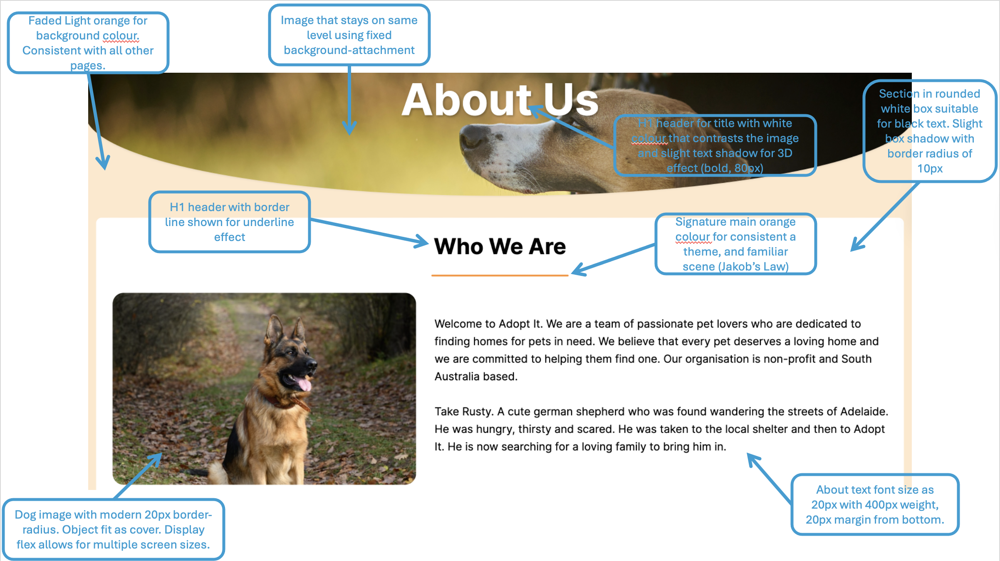
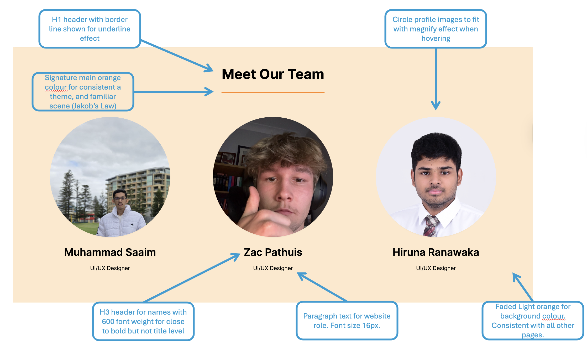

**Key elements annotated:**

This annotated screenshot presents the upper section of the About Us page for the Adopt It pet adoption website. The page uses the same faded light orange (`#ffe8cc`) background as the rest of the site so users experience a consistent look across pages. A full-width hero banner displays a dog image with a parallax-style effect using `background-attachment: fixed`, keeping the image visually anchored while content scrolls. The main “About Us” title is a bold white H1 (80px) with a text shadow so it remains readable against the photograph.

Below the banner, the “Who We Are” section sits inside a white rounded container (10px border-radius and light box shadow) suitable for black body text. The section heading uses an H1 with an orange underline in the site’s signature primary colour, supporting a familiar layout consistent with Jakob’s Law. A German Shepherd image (Rusty) is shown with 20px border-radius and `object-fit: cover` in a flex layout so the image and text adapt on different screen sizes. The mission text (20px, regular weight) introduces the non-profit organisation and tells Rusty’s adoption story to build an emotional connection with visitors.

The second annotated screenshot covers the “Meet Our Team” section on the same page. It repeats the orange underline heading style and cream background for visual consistency. Three team profiles (Muhammad Saaim, Zac Pathuis, and Hiruna Ranawaka) are displayed in circular images with a hover magnify effect. Each member’s name appears as an H3 (600 font-weight) with a 16px role label beneath (“UI/UX Designer”). JavaScript fade-in animations trigger when sections scroll into view, adding subtle interactivity without distracting from the content. The shared header, navigation bar, and footer link users to the Browser Page, Adoption Form, Contact Us, and external social pages.

---

### Adoption Form — Muhammad Saaim (saai0013)

**Source file:** `adoption_form.html`

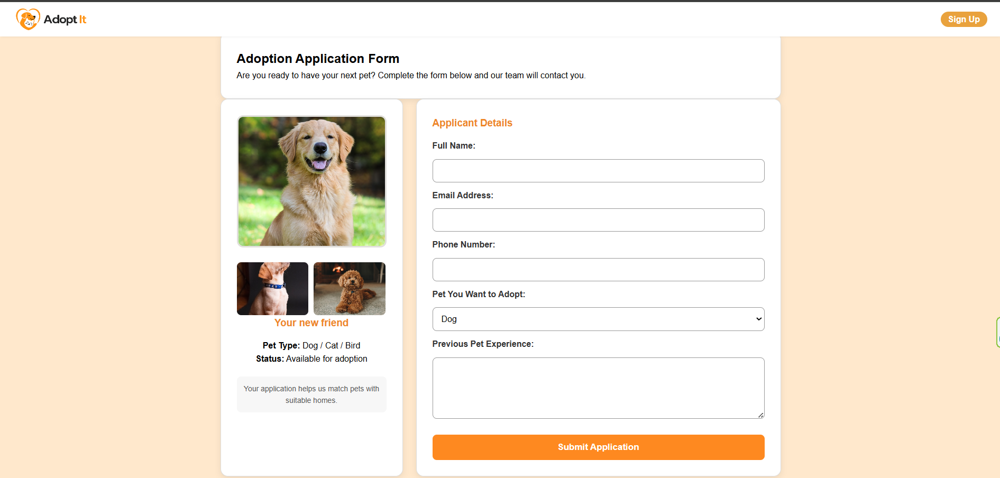

**Key elements annotated:**

Adoption Form page allows the users to easily apply for a pet with the help of a clean and user-friendly interface. This page provides users with both pet images and information along with the application form where they can enter their personal details such as name, email, contact number, and etc. To avoid incomplete submission of forms JavaScript validation is used, and styling of the page has been improved through CSS to improve overall user experience.

---

### Browser Page — Zachary Pathuis (path0171)

**Source file:** `browser_page.html`

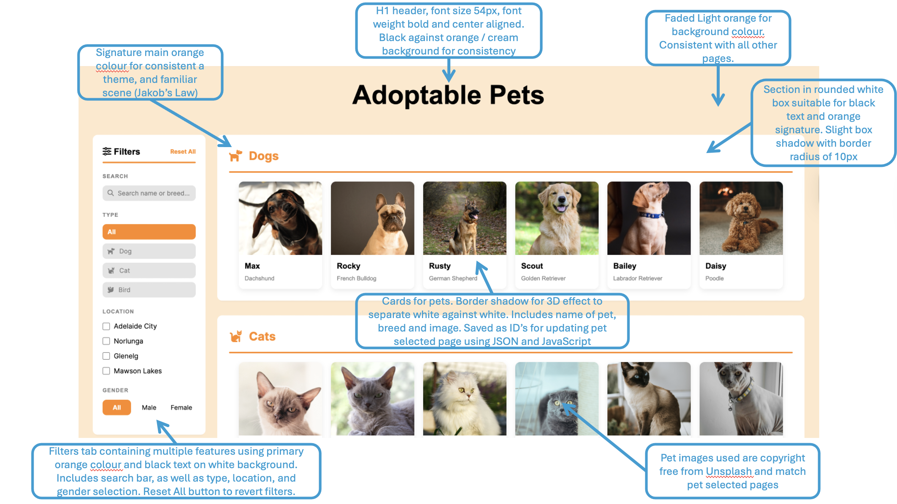

**Key elements annotated:**

This annotated screenshot presents the Browser Page of the Adopt It pet adoption website, where users search and browse adoptable pets. The page opens with a centred black H1 heading “Adoptable Pets” (54px, bold) on the same cream background used site-wide. The layout splits into a left filter panel and a right content area grouped by pet type (Dogs, Cats, and Birds).

The filter sidebar includes a search bar (name or breed), type buttons (All, Dog, Cat, Bird) with orange icons, location checkboxes (Adelaide City, Noarlunga, Glenelg, Mawson Lakes), gender filters, and a “Reset All” control. JavaScript applies these filters in real time and hides empty sections, showing a “no results” message when nothing matches. Each pet card sits in a white section box (10px border-radius, light shadow) and displays a photo, name, and breed. Cards use `data-*` attributes and unique IDs so clicking a pet opens `pet_selected.html` with the correct pet passed in the URL, linking to the JSON database used on the detail page. Pet images are sourced from Unsplash for consistent, copyright-free visuals across the browser and pet selected pages.

---

### Contact Us — Zachary Pathuis (path0171)

**Source file:** `contact_us.html`

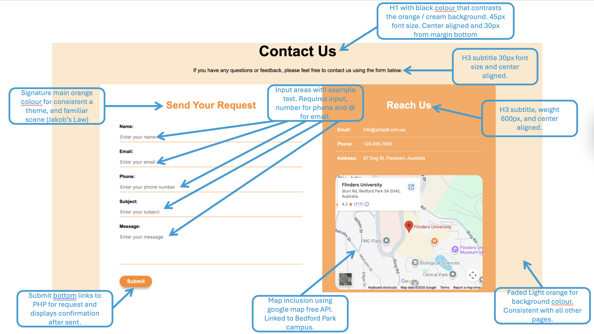

**Key elements annotated:**

This annotated screenshot presents the Contact Us page of the Adopt It pet adoption website. The page uses the standard cream background and a centred black H1 “Contact Us” (45px) with a 30px H3 subtitle explaining that users can send questions or feedback via the form below. The main content is a two-column contact box: a white left panel for the enquiry form and an orange right panel for centre details.

The “Send Your Request” form includes labelled fields for name, email, phone, subject, and message, with HTML5 validation (`required`, `type="email"`, `type="tel"`) and placeholder example text. The orange “Submit” button sends data to `php/data.php` via JavaScript `fetch`; on success the form is hidden and a confirmation message is shown, with a “Send Another Message” button to reset. The “Reach Us” panel lists email, phone, and address in white text on the brand orange background, and an embedded Google Maps iframe shows the Bedford Park campus location to help users find the adoption centre. The signature orange colour and split layout follow the same visual theme as other pages (Jakob’s Law), while the shared header and navigation bar keep movement between Browser, Adoption Form, and About Us straightforward.

---

### Homepage — Hiruna Ranawaka (rana0302)

**Source file:** `homepage.html`

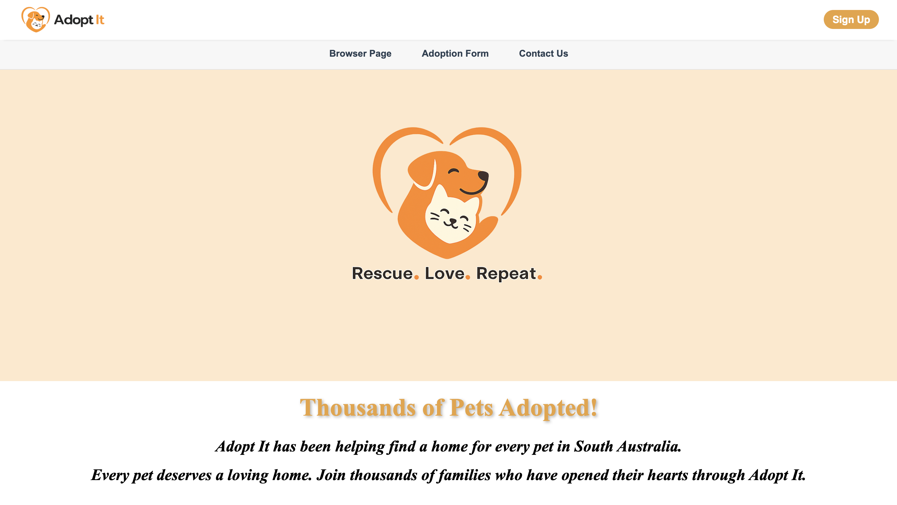
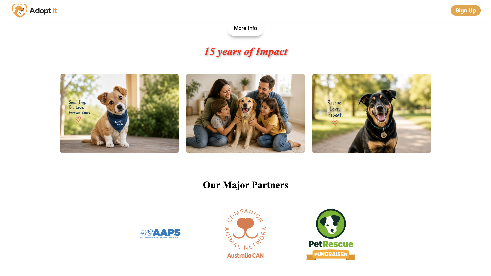

**Key elements annotated:**

This annotated screenshot presents the homepage of the Adopt It pet adoption website. The homepage was designed with a clean and welcoming layout to create a positive first impression for users. It includes a navigation bar for easy access to pages such as the Browser Page, Adoption Form, and Contact Us, along with a prominent “Sign Up” button that redirects users to the profile page after registration.

## The homepage also highlights the organisation’s mission through engaging visuals, adoption statistics, and inspirational slogans such as “Rescue. Love. Repeat.” Images of pets and families were included to create an emotional connection with users, while the partner section was added to showcase trusted organisations supporting the adoption platform. Additionally, the “More Info” button directly navigates users to the About Us page for further details about the organisation and its mission.

### Log In — Hiruna Ranawaka (rana0302)

**Source file:** `log_in.html`

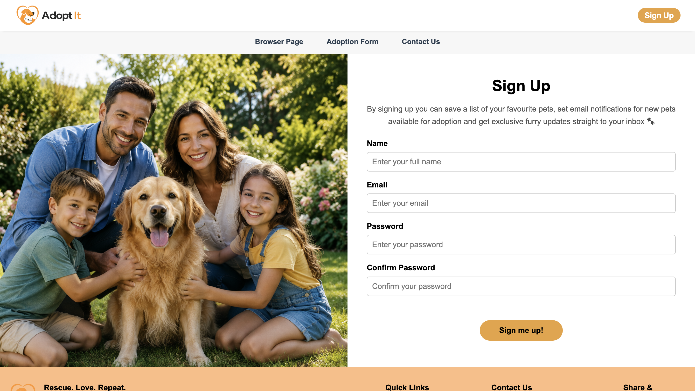

**Key elements annotated:**

This annotated screenshot presents the Sign Up page of the Adopt It pet adoption website. The page was designed with a clean and user-friendly layout, combining a welcoming family-and-pet image with a simple registration form. Users are required to enter their name, email, password, and confirm their password before clicking the “Sign me up!” button. JavaScript validation was implemented to check password confirmation, and after a successful sign up, the user is redirected to the homepage.

---

### Pet Selected — Hiruna Ranawaka (rana0302)

**Source file:** `pet_selected.html`

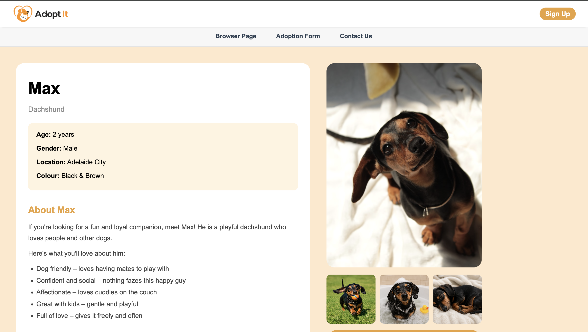
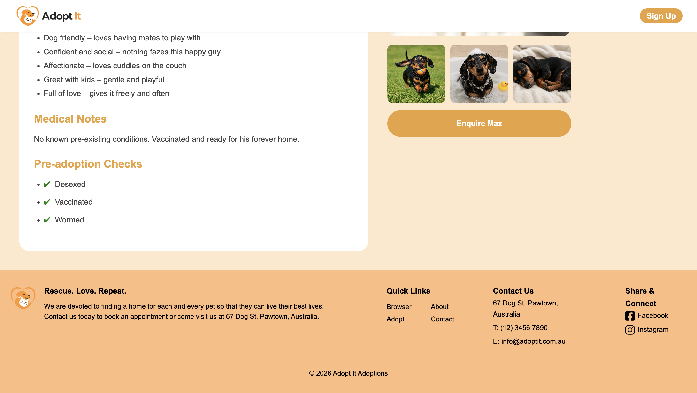

**Key elements annotated:**

This annotated screenshot presents the Pet Selected page of the Adopt It pet adoption website. The page was designed to provide detailed information about a selected pet, including its age, gender, location, colour, medical notes, and pre-adoption checks. Images of the pet were displayed in different activities to help users better connect with the animal before adoption.

The page also includes an “Enquire Max” button that redirects users to the adoption form page to continue the adoption process. JavaScript and JSON integration were used to dynamically update the pet details and images depending on the pet selected by the user from the browser page, creating a more interactive and personalised user experience.

### Profile Page — Muhammad Saaim (saai0013)

**Source file:** `profile_page.html`

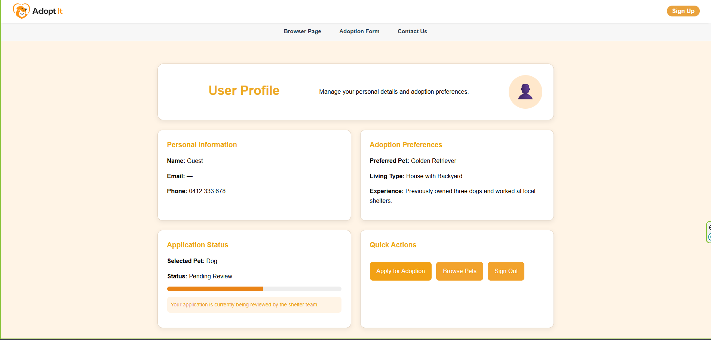

**Key elements annotated:**

This profile page allows the users to manage their personal details including pet related information and their preferences. The page also highlights user's name, living conditions and previous pet experiences. Moreover, the application status bar allows the users to trace their adoption progress. To make it easy for the users, quick action buttons are added which allows them to apply for adoption, log out or browse pets. Responsive CSS styling is also added to make it user friendly and easily accessible for all users.
---

## Back-End Communication (rana0302, saai0013)

_Describe how the front end communicates with the server (or planned integration). Include request/response flow, endpoints, data formats, and error handling where relevant._

### Overview (rana0302)

The front end communicates with the back end using HTTP requests and responses. When a user performs an action such as signing in, viewing pets, or submitting forms, the front end sends requests to the server. The server processes the request, interacts with the database when necessary, and returns a response to the front end. The front end then updates the user interface based on the received data. Error handling is also implemented to display appropriate messages if a request fails or invalid information is entered this is mainly done through javascript.

### Implementation Details for back-end communication (rana0302)

The back-end communication for the Adopt It website was mainly implemented using JavaScript and JSON to create dynamic interactions between pages and user inputs. One of the key implementations was on the pet selected page, where a JSON file was used to store pet information such as names, breeds, descriptions, medical notes, and images seperately for all pets. When a user selected a pet from the browser page, JavaScript retrieved the corresponding data from the JSON file structure and dynamically updated the page content and images. This allowed multiple pet informationa and images to be displayed using a single html page design rather than creating separate HTML pages for every pet.

JavaScript was also used extensively for form validation and error handling throughout the website. For example , on the sign up page, validation ensured that the password and confirm password fields matched before allowing account creation, while error messages were displayed if invalid data was entered. Similarly, the adoption form and contact form validated user inputs such as email addresses, phone numbers, and required text fields before submission. Although the project currently focuses mainly on front-end implementation, the structure was designed with few back-end integrations as well.

### Security and validation (saai0013)

Client-side validation checks were added in our web pages using JavaScript which improved the ease of use and reduce incorrect user input. These checks also ensured that user correctly enters all important fields such as contact number, name, and email address. This will avoid incomplete forms and enhance overall user experience by responding immediately to the user.

To improve the responsiveness and user interactivity of user, CSS was added and linked to the webpages. A friendly user-interface was added by implementing color contrast, button styling, and form layouts. Our layouts were responsive being considering that they can be used on multiple screen sizes.

While developing our web pages we considered basic security by using semantic HTML structure and organized file management was practiced to avoid errors and improve code readability. Backend implementation was not completely implemented, while that project structure was to be done for upcoming JSON and PHP integration. Backend data-cleaning and privileged access could have been significant in producing a final version of our website.

Overall, we focused on improving validation and a simple interface design to reduce number of user errors and a long-term trustworthy experience for our users.

---

## Style Guide Summary (path0171)

Our website uses various theory concepts and styling techniques to build a warm and friendly theme, built around an orange colour palette. Most of the styling comes from [`styles/global.css`](../styles/global.css) (header, nav, footer), with each page adding its own CSS file on top for individual aspects.

### Colour palette

| Role       | Colour                           | Usage                                                                                                                                                                                                                              |
| ---------- | -------------------------------- | ---------------------------------------------------------------------------------------------------------------------------------------------------------------------------------------------------------------------------------- |
| Primary    | `#fe8920` / `rgb(233, 162, 61)`  | Main brand orange used for nav hover, filter buttons, form accents, section headings, submit buttons, etc                                                                                                                          |
| Secondary  | `#e07515` / `#ffa75a`            | Darker orange for button hover and contrast between sections such as contact panel right side and footer background `#ffbb80`                                                                                                      |
| Background | `#ffe8cc`                        | Very light slightly transparent orange / cream colour used for background on homepage, browser, contact, about, pet selected, adoption, and profile                                                                                |
| Text       | `#000000`, `#2c3e50` , `#888888` | Body text is black as it works best againts the light coloured backgrounds used. Navigation links used `#2c3e50`, following similar style to hyper links. Secondary text such as breed labels used grey for contrast againts white |

White (`#ffffff`) is used for all other aspects of the websites such as cards, filter panels, and form containers. Homepage impact headings also use **red** for emphasis on the “15 years of Impact” line.

### Typography

| Element      | Font family                                                                                                                                                                                | Size / weight                                                                 | Usage                                                                             |
| ------------ | ------------------------------------------------------------------------------------------------------------------------------------------------------------------------------------------ | ----------------------------------------------------------------------------- | --------------------------------------------------------------------------------- |
| Headings     | `"inter", sans-serif` (most pages for casual modern look, combines well with the warm themed colour palette) `"Times New Roman", serif` (homepage impact section, attention grabbing look) | Page titles ~45–54px bold; section headings ~18–34px; paragraph text ~14-16px | Browser “Adoptable Pets”, contact “Contact Us”, filter labels, profile headings   |
| Body         | `"inter", sans-serif`                                                                                                                                                                      | 14–16px, line-height 1.6                                                      | Paragraphs, form labels, footer text, pet descriptions                            |
| UI / buttons | `"inter", sans-serif`                                                                                                                                                                      | 15–16px bold                                                                  | Header “Sign Up” / “User Profile”, nav links, filter buttons, form submit buttons |

Font "Awesome 6.5" is also loaded on all pages for icons such as dog, cat and bird for filters as well as social links and sliders.

### Layout and components

- **Navigation:** Sticky white header with logo (when clicked links to homepage) and orange button for sign-up page with turns into profile page once signed in. Another grey bar sits below that contains the main navigation page links centred for visual consistancy. Hovering over the nav links (Browser, Adoption Form, Contact Us) highlights the text orange with a bottom border acting as an underline. Same header and nav bar appear on each page via a shared HTML structure and [`header.js`](../scripts/Zac/header.js).
- **Buttons and forms:** Primary actions such as submitting forms use an orange fill with white text and rounded corner for a modern look, typically sitting around 20-30px `border-radius`. Hovering over these buttons darkens the orange and change cursor to pointer to make it clear that its clickable. Form inputs in contact us and adoption form pages use a simple underline style (`border-bottom: 1px solid #fe8920`) and example text for input. Client-side validations runs in JavaScript before data is sent to PHP, storing the messages. Requires hosted PHP to run.
- **Cards / listings:** The pet cards on the browser page are in white boxes with 10px rounded corners and a light shadow with an orange section title for a modern look. Profile and adoption sections use white cards on the light orange / cream background with padding and subtle border shadows.
- **Consistency:** Each page share the same header, footer and navigation. They also share the same orange colour palette providing that warm feeling. There is also CSS files for each page that handle layout, contact areas, text font, image design, padding and margins. Logo assets such as `logo_with_text_transparent.png` and `logo_transparent.png` are reused in the header and footer. Images for pets are also used across both the browser page and pet selection page.

### Accessibility

- Semantic HTML is used across the site (`header`, `nav`, `main`, `footer`, `section`, `aside`, heading levels).
- Images include `alt` text (logos, pet photos, team profiles).
- Form fields use `<label>` elements linked to inputs and required fields are marked in HTML.
- Colour contrast is kept readable with dark text on light backgrounds and orange is used mainly for accents and buttons with white label text.
- Layouts use flexible widths (percentages, `max-width`, flex / grid) so content scales on different screen sizes, though the site is not optimised for mobile.

---

## Individual Reflections

_Each team member: ~300 words on the design-to-prototype process, complexity of development, and accommodations needed for successful deployment._

---

### Muhammad Saaim — saai0013

> **Word count target:** ~300 words

During the development of our Adopt It pet adoption website, I earned productive experience in making functional and interactive web pages. While doing our assignment 1, our main goal was on making user-focused designs through personas, wireframes, storyboards and user flows. In our assignment 2, I converted all of these concepts into fully functional and working web pages with the help of HTML, CSS, and JavaScript. This procedure helped me in understanding the significance of designing with both practicability and viability in mind.

My main part in this website project was to develop Pet Adoption Application Form and the User Profile page. A challenge I faced during the development was to implement front-end and back-end communication without the use of external libraries. I had to cautiously structure the inputs, create both CSS and JavaScript files for data handling. Issues such as debugging, invalid file paths, inactive links, and multiple HTML elements improved my problem-solving abilities to a great extent.
Another key aspect of our website was to make sure the website is user friendly and easily accessible for all users. I did my best to apply adaptive and intuitive designs, clear navigation and semantic HTML and visual structure to improve ease of reading across multiple screen sizes. Validation checks using JavaScript were also added to avoid input errors and improve overall user experience.

To achieve successful development, our project was made using systematic folder structures which were named as per each individual team members to avoid confusions. Our team members also collaborated through GitHub to experience the importance of working in a team environment, communication and maintain professional coding practices. Overall, my concepts of web development were strengthened while working for this assessment.

---

### Zachary Pathuis — path0171

> **Word count target:** ~300 words

During the development of our Adopt It pet adoption website, I gained valuable experience turning UX design concepts from Assignment 1 into working web pages. In the earlier assignment, I contributed personas, wireframes, user flows, and a sitemap for the browser and admin areas. In Assignment 2, I applied that planning to build the About Us, Browser Page, and Contact Us pages using HTML, CSS, and JavaScript. This process strengthened my understanding of how early design decisions affect implementation and usability.

My main responsibility was developing pages where users browse and enquire about pets. On the browser page, I implemented search and filter controls in JavaScript so users could narrow listings by type, gender, location, and name, with each pet card linking to the pet selected page via URL parameters. I also built the contact and about pages, including form validation and layout styling in dedicated CSS files. A significant challenge was keeping the site visually consistent across teammates’ pages. I worked on shared elements such as the header script, which updates the sign-up button to a profile link when a user is logged in, and contributed to global styling and the style guide summary so colours, typography, and navigation stayed aligned.

To support successful deployment, I helped organise our folder structure by team member and used GitHub regularly to merge changes, fix broken paths, and coordinate updates such as the JSON pet database and header behaviour. I also aimed for clear navigation and semantic HTML so pages remained readable and accessible across different screen sizes. Debugging issues like inactive links, margin errors, and pet-not-found handling improved my problem-solving skills. Communication with my teammates before starting each page was important, and our Assignment 1 wireframes and user flows made implementation much smoother. Overall, this project deepened my knowledge of front-end development, teamwork, and translating user-centred design into a cohesive, functional website.

---

### Hiruna Ranawaka — rana0302

> **Word count target:** ~300 words

In relation to this assignment, there have been several lessons I learned in regards to web page creation. During this entire process, it would be important to note that my position in this was to design the homepage, sign-in page, and pet selected pages. This is in the sense that the objective of the design was to ensure that the user's attention was attracted as well as ensuring that the designs were understandable by the viewer.

Apart from designing the pages, I managed to develop CSS styles for the whole web application and create header, footer, and navigation bar for the website. At the same time, thanks to the changes made by my teammates to the pages, the issue of redundancy could be avoided while creating the web application. Nevertheless, there were still some challenges I had to deal with like the website contained lots of similarities in terms of color, fonts, and spaces used. Therefore, it was important to stick to the existing design and making that the common parts were all the same.

To achieve a successful webpage, I think that communication within the team and planning accurately before starting is crucial and I think that assignment 1 – UX design report helped us a lot where we planned out on how are web page is going to look with the help of the wireframes and storyboards that we designed. Also, we found it difficult at that start on how to think of working together on the same set of pages at once and then we figured it out through GitHub where it helped us to work on our individual pages separately but at the same time. Overall, during this project I gained a lot of knowledge regarding web development and improved my coding practices as well.
