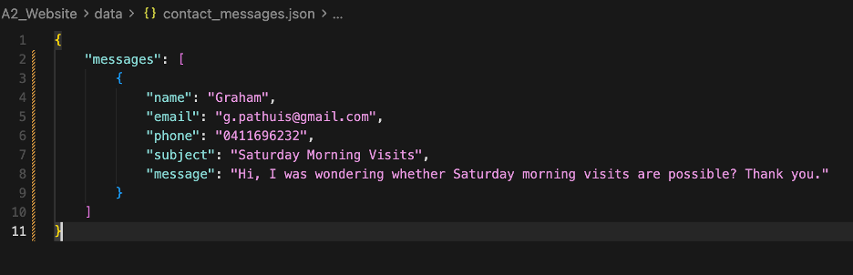

Appendix: should include all required materials to recreate your UX evaluation test
        FAN annotated list of each team member covering:
        sections of the report completed
    test artefacts created
    their roles during the evaluation
    count of how many tests they were involved in
    Script
    Survey and/or interview questions
    Description of tasks to be completed
    Transcript of UX evaluators’ think-aloud sessions and any additional comments made
    Data captured
    Supporting observational data (screenshots, photos, etc.).  

Rana0302
Sign Up, Navigation to about us page from home page

Appendix 1
Test Participant 1: 5 

Description:
    The first test participant is Kinura, a 24-year-old postgraduate student. He regularly uses a Lenovo laptop for both academic and work-related tasks, making him confident and comfortable when using technology and navigating websites. However, he has no background in programming or web development, so he approaches the website from the perspective of a typical end user.

    Kinura moved from Sri Lanka to Australia four years ago and had to leave his pet dog behind when he migrated. Since then, he has missed having a pet companion and is currently interested in adopting a pet to help overcome feelings of loneliness. As someone actively looking to adopt a pet, he represents a realistic target user for the Adopt It website
Task perfromed - Sign Up process
    The participant was asked to complete the sign-up process by creating a new account on the Adopt It website. This task involved navigating to the sign-up page, entering the required personal information such as name, email and also creating and confirming a password, and submitting the request by clicking the sign me up button. The objective was to evaluate how easily a first-time user (Kinura) could locate the sign-up page, understand the required fields, complete it successfully, and receive feedback from the system during the registration process. This task also tested the effectiveness of the overall user experience for new users.
Methodology results (Post Test Questions):
    1.	How was your overall experience in the signup process?
        
        During the post-test interview, Kinura provided positive feedback regarding the overall sign-up process and found it very easy to complete. 
    
    2.	Are there any areas that you think we should change to make this more user friendly?
        
        He suggested that the registration  should include a phone number field. According to him, providing a phone number would improve account security by allowing additional verification methods and make it easier for users to receive important notifications and updates. He explained that he rarely checks his email, so receiving alerts through a phone number would be more convenient and ensure that he does not miss important information related to pet adoption enquiries and account activity. This feedback highlights a potential improvement that could enhance both the usability and functionality of the sign-up process.

Appendix 2
Test Participant 2: Mark
Description:
    The second test participant is Mark, a 65-year-old retired army soldier. Due to his age and previous career, he has had limited exposure to modern technology and does not use digital devices frequently. He owns an older desktop computer at home, which he uses only for basic tasks such as browsing the internet and checking information when necessary. As a result, he is not highly confident when navigating websites and can sometimes find complex interfaces confusing.

    Following the passing of his wife, Mark has been looking for a dog companion to help cope with loneliness and boredom. Having spent much of his life serving in the military and working closely with fellow soldiers, he is fond of being surrounded by people for most of his life and finds living alone challenging. As a potential pet adopter, Mark values simplicity and efficiency when using websites. He prefers having clear navigation, easy access to important information, and straightforward processes that do not require excessive clicking or searching. 

Task perfromed: - Navigating to various locations in search of a pet
    Mark was asked to navigate through the Adopt It website to search for a suitable pet. This task involved browsing different sections of the website, viewing available pets, accessing individual pet profiles, and locating relevant information that could help him make an adoption decision. The objective was to evaluate how easily an older user with limited technological experience could navigate the website, find desired information, and move between pages without confusion. This task also assessed the effectiveness of the website’s navigation structure, clarity of labels, and overall accessibility for users who prefer quick and straightforward access to information.
Methodology results (Thinking Aloud Process):
    During the think-aloud session, Mark commented that he found the website easy to navigate overall. He was able to move from the sign-up page to the browser page, select a pet, and access the adoption form without experiencing any major difficulties. He appreciated the straightforward navigation and felt that the adoption process was simple to follow, even with his limited experience using technology.

    However, Mark encountered an issue when he wanted to learn more about the organisation before proceeding with the adoption process as he was concern regarding the companies effectiveness and background. After signing up, he looked for information about the company but was unable to immediately locate the About Us page. When he asked me where he could find this information, I showed him that it was accessible through the small “About” link in the footer and through the “More Info” button on the homepage. Mark expressed dissatisfaction with both options. He felt that the footer link was too small and difficult to notice, while the “More Info” button on the homepage was not prominent enough to attract his attention. As a result, he suggested adding an About Us option directly to the main navigation bar. According to Mark, this would make company information much easier to find and improve the overall user experience as it is a very important feature, particularly for older users who prefer clear and visible navigation options.

Saai0013
Submitting an Application, navigating the pet selected

Appendix 3
Test Participate 1: Anabella

Description: The first test participant is Anabella a 21 year-old student at university. She prefers to shop products and services online using her laptop. She was aware of all types of web applications and had a little bit digital literacy but she never used a pet adoption website. The testing tasks were carried out using Google Chrome on windows laptop.

Task perfromed - Submitting an Adoption Application:
Anabella was instructed to navigate to the application page, fill up all her details and then submit an application.

Initially, through navigation menu she navigated to the pet application page. Then, she viewed the pet images there and began to fill up her personal details. Next, she choose to adopt a pet using pet dropdown menu. After that, she typed her previous pet experience in that specific field and finally pressed the submit application button.

Methodology results - Observation:
Anabella's observation during the testing were noted down and are as follows:

1. Participant was able to easily understand page layout without any hesitation.
2. There was no difficulty in locating navigation menu.
3. Participant expected some enhanced confirmation response before pressing the submit button.
4. Participant suggested to add a popup after final submission of the adoption application.
5. She also appreciated the pet images and responsive and user-friendly layout.

Appendix 4
Test Participate 2: Novera Aayan

Description: Second participant is a 20 year old undergraduate student at university studying Accounting and Finance. She has a high digital literacy of modern technology and completed our testing on her mobile phone using Google Chrome.

Task perfromed:
She was instructed to start with the Browse Pets page, choose a pet and go through the details of that specific pet.

Firstly, she opened the Browser Page using the navigation menu and looked through all the pets and then opted for a dog named "Rocky".Then, she went through all the information of Rocky and finally navigated to the application form page.

Methodology results - Pre-test Questions:
1. How familiar are you with latest websites and forms?
Ans. I frequently use online services, and shopping websites.

2. Have you used a pet adoption website earlier?
Ans. No, I have never used but I am familiar with similar web pages and layputs.

3. What are your expectations from a pet adoption webiste?
Ans. All the pet information must be clear, navigation and layouts should be user-friendly and responsive with a simple process for adoption.

Path0171
Filtering to find a specific dog, Contacting people

Appendix 5
Test Participate 1: Joel
Description:
The first test participant was a 19-year-old university student named Joel. He uses a 13-inch M1 MacBook Air for daily study and personal use. He is comfortable with using tech and navigating websites; however, he is not a developer. He has never explored or adopted through a pet adoption website before. The website was tested on his laptop using Google Chrome, and he had no prior briefing on the layout of the site, only a short description of what the website is for. He represents a younger and tech-literate adopter who wants to narrow down options quickly rather than scroll through every animal.

Task Performed – Filtering to find a specific pet:
For the purpose of this task, the pet that will be found is Daisy, who is a female poodle. 
Instruction given:
“Starting on the browser page, you want to use the tools given to select Daisy, a female Poodle located in Glenelg, and open her pet profile page”
Steps taken:
Step 1: Navigated to the filter tab on the left side and clicked “Dog” under TYPE. This hid the Cat and Bird cards, so only dogs remained (~10 seconds)
Step 2: Clicked “Female” under GENDER. This is his Male dogs, such as dogs, leaving Daisy and Bailey visible (~3 seconds)
Step 3: Clicked “Glenelg” under LOCATION. Bailey became hidden, and Daisy remained (~3 seconds)
Step 4: Clicked on the image in Daisy’s card, which opened her pet profile (~5 seconds)
Total time to complete: ~21 seconds
Outcome: Daisy was successfully selected, and the filtering tools were effectively used to find the pet.

Methodology Results – 10-question post-test survey:
Scale: 1 = Strongly Disagree, 5 = Strongly Agree
Questions:
1.	Did you understand what had to be done to complete the task?
Rating: 5
Comment: Yes, instructions were clear and easy to follow. 

2.	Did you find the filter panel easy to locate?
Rating: 5
Comment: Yes, the filter panel was obvious and easy to find. I liked how it followed the page as I scrolled. I also liked how it contrasted the background colours with a big, white, rounded box. The filter headings were noticed immediately, also.

3.	Could you understand the structure of the page, and did it feel organised?
Rating: 5
Comment: Yes, it was well organised and visually appealing. The nav link and footer were well designed and easy to navigate, also. Side filters and the main grid matched and were both very easy to follow.

4.	Did the labels on the filters make sense (Type, Location, Gender, Search)?
Rating: 5
Comment: Yes, each label was clear, and my expected results matched the filtering. I did notice, however, a spelling mistake of Noarlunga, which is spelt “Norlunga”. Also, due to the small number of pets, filtering didn’t really feel needed, and if you know what pet you are looking for, the search bar is the obvious option.

5.	Did combining filters work as you expected?
Rating: 5
Comment: Yes, combining filters worked as expected and updated accordingly.

6.	Could you tell when no pets matched the filter?
Rating: 5
Comment: Yes, I could tell based on the information on the pet cards. However, I never got to the stage where no results were shown, so I cannot comment on what happens in such a scenario.

7.	Did the pet cards shown have enough information for you to confirm you have the right pet before selecting?
Rating: 5
Comment: Mostly, the name and breed on the card were enough for the basics, but I noticed that when filtering for location, there was no indication on the card, so I had to trust the filters completely. More info, like location and also age on the card, can feel more reassuring and make me confident in my decision. 

8.	Would you feel confident browsing this site to find pets again?
Rating: 5
Comment: Yes, however, I think I would just scroll to find pets with the number currently on the site, or use the filter to find a location without having to select each pet to tell.

9.	Based on your experience with this page, do you believe you could effectively navigate other pages too?
Rating: 5
Comment: Yes, if all pages follow a similar style and experience, I could effectively navigate through each page without error.

10.	Were you satisfied with the experience of finding a pet to adopt?
Rating: 5
Comment: Yes, I was overall satisfied with the experience, with only mild frictions here and there, such as the card details and Noarlunga spelling. However, these did not affect my overall satisfaction. I also loved the design of the website; it was appealing, and the small animations were not overwhelming, often making the website easier to navigate.

Appendix 6
Test Participate 2: Graham
Description: 
The second participant is a 55-year-old male named Graham, who is a full-time construction planner. He uses a desktop computer for scheduling, email and document review, and is proficient in software such as Revit and Excel. He is comfortable with standard web forms but prefers clear labels and does not like overwhelming animations that he sees on modern websites. Graham has never used a pet adoption site before, so he is new to the website style. The task was tested on a Windows desktop using Google Chrome, with no prior experience of the website.

Task Performed – Filling in the Contact Us form:
Instruction given:
“Starting on the Contact Us, following the on-page instructions to fill in the form, send a message asking whether Saturday morning visits are available. Be sure to fill in all sections of the contact form.”
Steps taken:
Step 1: Skimmed through the intro text and glanced at Reach Us information and map implementation. (~20 seconds)
Step 2: Filled Name: Graham. (~5 seconds)
Step 3: Filled Gmail: g.pathuis@gmail.com. Spelt gmail as gamil, but corrected it. Formatting was accepted either way. (~25 seconds)
Step 4: Filled Phone: 04** *** *** (~10 seconds)
Step 5: Filled Subject: Saturday Morning Visits (~15 seconds)
Step 6: Filled Message: Hi, I was wondering whether Saturday morning visits are possible? Thank you. (~40 seconds)
Step 7: Navigated to and clicked submit. Reviewed information before submitting and after, received “Message Sent!” confirmation, along with “Thanks for reaching out…”. (~10 seconds)
Step 8: Confirmed that the task was complete and did not choose to “Send Another Message”. (~5 seconds)
Total time to complete: ~ 2 minutes and 28 seconds
Outcome: Form was submitted successfully with confirmation message “Message Sent!” shown. Data was successfully saved via php/data.php and added to the contact_messages.JSON.
Evidence:

Methodology Results – Single Ease Question (SEQ):
Scale: 1 = Strongly Disagree, 5 = Strongly Agree
Question: How easy or difficult did you find it to complete this task, and why? Do you think others would share a similar opinion?
Rating: 4
Comment (Transcribed as accurately as possible from conversation): “Sending a message via the Contact Us form was pretty easy. The form is what I’d expect, and what I was familiar with. I wasn’t quite sure of a couple of things, mainly the format of the phone number. It was not mentioned whether I needed spaces or dashes or neither, and whether it was done by country code or not. The “Message Sent” bit was a helpful and obvious indicator that my message had been sent and received. I think one point of improvement for the email section, particularly, could be a dropdown of popular mailing extensions for ease of use, as spelling an email extension wrong could often be hard to notice when looking back through why a form didn’t submit.”
